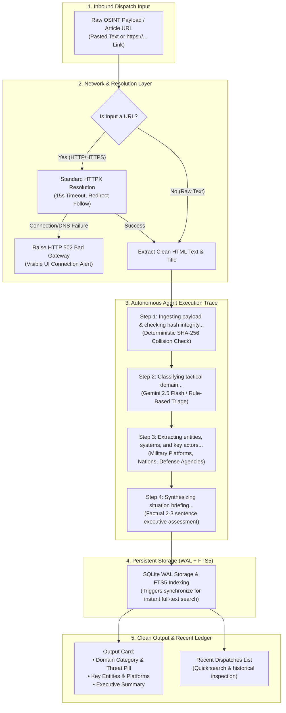

# ASTRA SENTINEL — AUTONOMOUS INTEL AGENT INTERFACE

[](https://www.python.org/)
[](https://fastapi.tiangolo.com)
[](https://sqlite.org)
[](https://ai.google.dev)
[](https://astra-ia6g.onrender.com/)
[]()

> **ASTRA 3-Day Build Challenge — Autonomous Intel Agent Interface**  
> A clean, centered, single-flow autonomous intelligence agent interface for Open-Source Defence Intelligence (OSINT) triage, domain classification, platform extraction, and situation briefing synthesis.  
>  
> 🌐 **Live Deployed Web Application:** [https://astra-ia6g.onrender.com/](https://astra-ia6g.onrender.com/)

---

## 1. Single-Flow Agent Architecture

The application implements a centered single-flow agent execution pipeline:



---

## 2. Key Capabilities & Features

* **Centered Single-Flow Agent Interface:**  
  Clean, modern, single-column layout with zero clutter. Features a minimal header with a pulsing status dot, an input area accepting text or URLs, an active 4-step execution trace, an elevated output card, and a recent dispatches list.
* **Network Resolution & Graceful Error Handling:**  
  All external network requests use standard `httpx` client configurations with standard timeouts (`REQUEST_TIMEOUT = 15.0s`). If network resolution fails (DNS errors, connection timeouts, or unresolvable domains), the UI clearly presents a connection diagnostic banner rather than silently falling back without feedback.
* **Active 4-Step Agent Execution Trace:**  
  Real-time feedback as the agent works through:
  1. `Ingesting payload & checking hash integrity...`
  2. `Classifying tactical domain...`
  3. `Extracting entities, systems, and key actors...`
  4. `Synthesizing situation briefing...`
* **Deterministic SHA-256 Deduplication Gate:**  
  Fingerprints all incoming content. Exact duplicates trigger an `HTTP 409 Conflict` and present an alert banner displaying the collided hash and record ID.
* **Persistent SQLite with WAL & FTS5:**  
  All dispatches are saved with Write-Ahead Logging and synchronized to a Porter-stemmed FTS5 virtual table for instant full-text and acronym searches (`UAV`, `AESA`, `DRDO`).

---

## 3. Project Directory Structure

```text
astra-sentinel/
├── .env.example              # Configuration template
├── .gitignore                # Protects secrets, databases, and caches
├── requirements.txt          # Python production dependencies
├── pytest.ini                # Pytest configuration
├── conftest.py               # Workspace path configuration
├── README.md                 # System documentation & AI disclosure
├── app/
│   ├── __init__.py           # App package identifier
│   ├── config.py             # Settings, network timeouts, constants
│   ├── database.py           # SQLite connection, WAL mode, FTS5 sync triggers
│   ├── models.py             # Pydantic schemas (AnalyzeInput, AnalyzeResponse, etc.)
│   ├── processor.py          # URL resolution, Gemini pipeline, SHA-256 deduplication
│   ├── intelligence.py       # FTS5 search engine & SitRep briefing synthesizer
│   ├── main.py               # FastAPI server, REST API & static mounting
│   └── templates/
│       └── index.html        # Clean, centered single-flow agent workstation
├── data/
│   └── starter_articles.json # Preloaded defence intelligence dispatches
└── tests/
    └── test_engine.py        # Automated pytest suite (9 tests covering agent & network)
```

---

## 4. Setup & Quick Start

### 🌐 Live Production Deployment

The operational agent interface is deployed and available live:
* **Production Web Interface:** [https://astra-ia6g.onrender.com/](https://astra-ia6g.onrender.com/)
* **Live Health Diagnostic:** [https://astra-ia6g.onrender.com/api/health](https://astra-ia6g.onrender.com/api/health)
* **Interactive OpenAPI Specs:** [https://astra-ia6g.onrender.com/docs](https://astra-ia6g.onrender.com/docs)

---

### Local Installation & Development

1. **Clone the repository:**
   ```bash
   git clone <repo-url> astra-sentinel
   cd astra-sentinel
   ```

2. **Install dependencies:**
   ```bash
   pip install -r requirements.txt
   ```

3. **Configure Environment Variables (Optional):**
   ```bash
   cp .env.example .env
   ```
   > **Note:** If `GEMINI_API_KEY` is not provided, the system operates in offline deterministic rule-based mode, ensuring complete local autonomy.

4. **Run the Automated Test Suite (9 tests):**
   ```bash
   pytest tests/test_engine.py -v
   ```

5. **Start the Operational Agent Server:**
   ```bash
   uvicorn app.main:app --host 0.0.0.0 --port 8000
   ```

6. **Access the Agent Interface:**
   Open your browser to:
   ```text
   http://127.0.0.1:8000
   ```

---

## 5. REST API Reference

| Method | Endpoint | Description |
|---|---|---|
| `GET` | `/` | Serves the clean, centered single-flow agent interface. |
| `POST` | `/api/analyze` | Unified agent endpoint: accepts text or URL, runs 4-step trace, returns output. |
| `POST` | `/api/ingest` | Direct structured ingestion endpoint (backward compatible). |
| `GET` | `/api/search` | Full-text FTS5 BM25 search with execution latency profiling. |
| `GET` | `/api/articles` | Lists chronologically ordered indexed dispatches. |
| `GET` | `/api/articles/{id}` | Retrieves a single dispatch by its identifier (`AST-XXXX`). |
| `POST` | `/api/sitrep` | Generates a grounded military Situation Report (SITREP / OPREP). |
| `GET` | `/api/stats` | Returns database telemetry, threat breakdown, and active categories. |
| `GET` | `/api/health` | Verifies node health, WAL mode, FTS5 status, and network timeouts. |

---

## 6. Automated Test Suite Verification

```text
tests/test_engine.py::test_ingest_unique_article PASSED          [ 11%]
tests/test_engine.py::test_deduplication_collision PASSED        [ 22%]
tests/test_engine.py::test_malformed_input_rejection PASSED      [ 33%]
tests/test_engine.py::test_fts5_acronym_search PASSED            [ 44%]
tests/test_engine.py::test_sitrep_generation PASSED              [ 55%]
tests/test_engine.py::test_health_and_telemetry PASSED           [ 66%]
tests/test_engine.py::test_analyze_agent_execution_flow PASSED   [ 77%]
tests/test_engine.py::test_analyze_duplicate_collision PASSED    [ 88%]
tests/test_engine.py::test_analyze_network_resolution_error PASSED [100%]

======================== 9 passed in 1.14s ========================
```

Health check verification:
```bash
$ curl -s http://127.0.0.1:8000/api/health
{
  "status": "operational",
  "system": "ASTRA SENTINEL",
  "version": "2.0.0",
  "wal_mode": true,
  "fts5_active": true,
  "triage_mode": "deterministic-rule-based",
  "timeout_seconds": 15.0,
  "document_count": 7,
  "active_categories": 5
}
```

---

## 7. Security & Privacy Posture
* **Zero Secrets Tracked:** No `.env` files or API keys are committed to version control.
* **Database Isolation:** SQLite storage files (`*.db`, `*.db-wal`, `*.db-shm`) are excluded via `.gitignore`.
